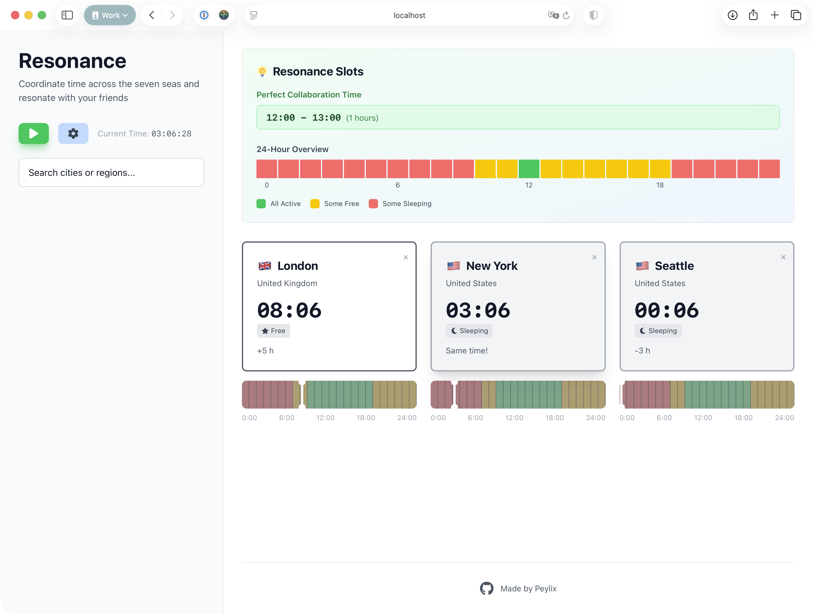

# 🕰️ Resonance

**Resonance** is a clock tool that helps people across different time zones find optimal times to connect. Visualize active hours, find overlap windows, and coordinate seamlessly across the seven seas.

## Features

- **Multi-Timezone Tracking:** Add cities to see real-time or designated-time views across multiple locations
- **Resonance Slots:** Automatically find continuous 24-hour windows where everyone is available simultaneously
- **24-Hour Visual Timeline:** Interactive and colorful timeline showing active hours (green), free time (yellow), and sleep hours (red)
- **Customizable Schedules:** Configure active hours and sleep times to match your schedule

### Screenshots



## Getting Started

### Installation

```bash
bun install
```

### Development

Start a development server with hot module reloading:
```bash
bun dev
```

### Production

Build and run for production:
```bash
bun run build
bun start
```

## Tech Stack

- **Runtime:** Bun + TypeScript
- **Framework:** React 19
- **Styling:** Tailwind CSS 4
- **State Management:** Zustand
- **Date/Time:** date-fns + date-fns-tz
- **Icons:** react-icons

